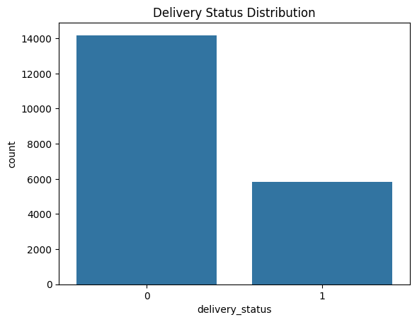
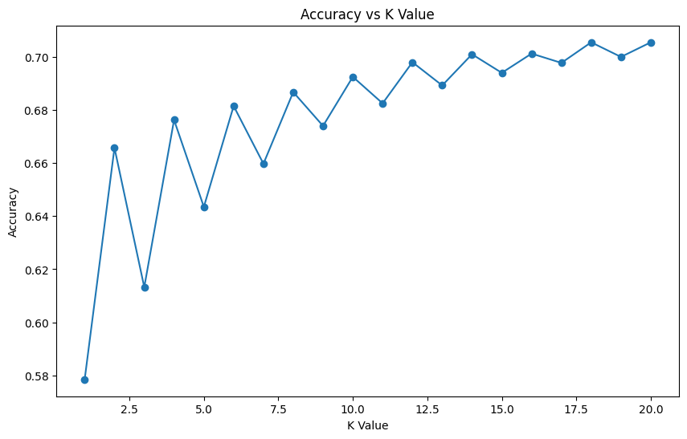
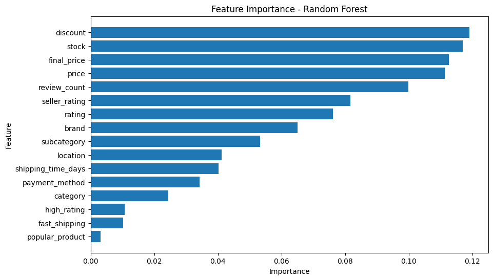

# 🚚 Delivery Delay Prediction Using Machine Learning

A beginner-friendly Machine Learning project focused on predicting e-commerce delivery delays using real-world Amazon-style transactional data.

This project applies supervised learning techniques to explore how operational, pricing, and customer-related variables influence delivery outcomes in a logistics environment.



---
## 📌 Project Objective

The goal of this project is to predict whether an order delivery will be delayed or not using Machine Learning classification models.

The project also explores:
- feature engineering
- model tuning
- feature importance analysis
- business insights from logistics data

---

## 📂 Dataset

- Source: Amazon E-Commerce Dataset [Find Dataset Here](https://www.kaggle.com/datasets/sharmajicoder/amazon-e-commerce)
- Original Size: ~1 Million Rows
- Working Sample: 20,000 Rows
- Features: 20+ columns including:
  - pricing
  - discounts
  - stock levels
  - seller ratings
  - shipping time
  - payment methods
  - product categories

---

## ⚙️ Machine Learning Workflow

### 1️⃣ Data Preparation
- Data cleaning
- Duplicate checks
- Feature selection
- Handling categorical variables

### 2️⃣ Feature Engineering
Created custom features such as:
- `high_rating`
- `fast_shipping`
- `popular_product`

### 3️⃣ Model Development
Implemented:
- K-Nearest Neighbors (KNN)
- Random Forest Classifier



### 4️⃣ Model Tuning
- Hyperparameter tuning using multiple K-values
- Performance comparison between models

### 5️⃣ Model Evaluation
Used:
- Accuracy Score
- Confusion Matrix
- Classification Report

---

## 📊 Model Results

| Model | Accuracy |
|---|---|
| KNN (K=5) | 64% |
| Tuned KNN | 70.5% |
| Random Forest | 70.8% |

---

## 🔍 Key Findings

- Delivery delay prediction proved to be a challenging real-world classification problem.
- Higher accuracy did not always mean better delay detection due to class imbalance.
- Pricing and inventory-related variables had stronger predictive influence than customer-rating-based features.
- Top influential features included:
  - discount
  - stock
  - final price
  - review count

---

## 📈 Feature Importance Insights



The Random Forest model identified the following as the most influential features:

- Discount levels
- Stock availability
- Product pricing
- Product popularity indicators

This suggests operational and inventory factors may influence delivery performance more strongly than customer behavior metrics.

---

## Tools & Technologies

- Python
- Pandas
- NumPy
- Scikit-learn
- Matplotlib
- Jupyter Notebook
- GitHub

---

## 📁 Project Structure

```bash
delivery-delay-prediction-ml/
│
├── data/
│   ├── raw/
│   └── processed/
│
├── notebooks/
│   ├── 01_data_exploration.ipynb
│   ├── 02_data_cleaning.ipynb
│   ├── 03_feature_engineering.ipynb
│   ├── 04_model_preparation_and_knn.ipynb
│   └── 05_random_forest_model.ipynb
│
├── visuals/
│
├── README.md
│
└── requirements.txt
```

---

## Final Conclusion

This project demonstrates a well-structured beginner Machine Learning workflow from raw logistics-related data to model evaluation and business insight generation.

While the models achieved moderate predictive performance, the project highlights the importance of:
- proper preprocessing
- model evaluation
- handling class imbalance
- interpreting ML results critically

---

## 👨‍💻 Author

**Selasey Dick Junior Gbeddy**

Aspiring Supply Chain & Logistics Analyst | Combining Data Analytics with Operational Intelligence
